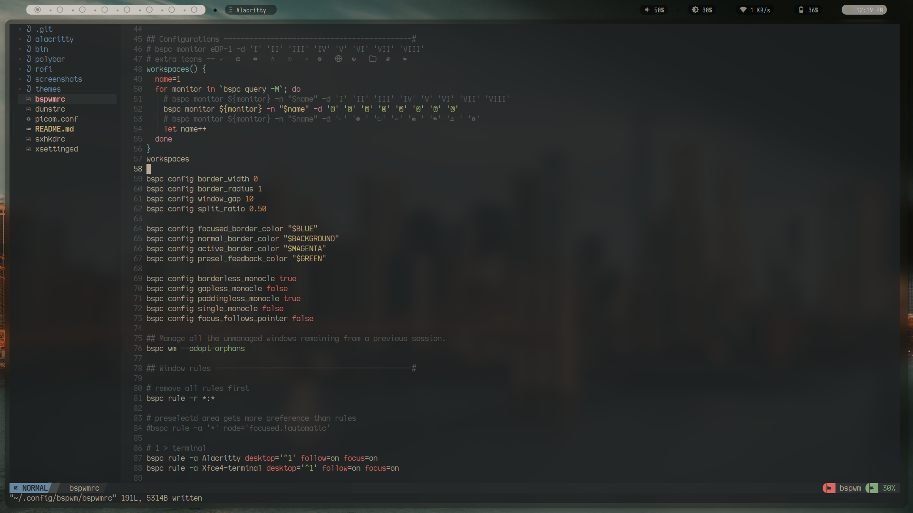

# Archcraft

WM : Bspwm

Bar: polybar

Terminal: Alacritty

App launcher: rofi

compositor: picom

Wallpaper: [twitter - @michaelboegl](https://twitter.com/michaelboegl/status/1607831306838097920?s=20)

**Dotfiles**: [github - @ComradeCat24](https://github.com/ComradeCat24/bspwm-dotfiles/)

        

### Gallery

#### Rofi

    <table>
		<tr>
			<td> <small>All Apps</small></td>
			<td> <small>launcher</small></td>
			<td> <small>Network</small></td>
		</tr>
		<tr>
			<td> <small>Theme</small></td>
			<td> <small>Windows</small></td>
			<td> <small>Screenshot</small></td>
		</tr>
		<tr>
			<td> <small>Root</small></td>
			<td> <small>media</small></td>
			<td> <small>Powermenu</small></td>
		</tr>
    </table>

#### Polybar

    <table>
		<tr>
			<td> <small>Main</small></td>
		</tr>
		<tr>
			<td> <small>Minimal</small></td>
		</tr>
    </table>

#### Applications

    <table>
		<tr>
			<td>Android Studio</td>
		</tr>
		<tr>
			<td></td>
			<td></td>
			<td></td>
		</tr>
		<tr>
			<td>VS Code</td>
		</tr>
		<tr>
			<td></td>
			<td></td>
			<td></td>
		</tr>
		<tr>
			<td>Firefox</td>
			<td></td>
			<td>Nvim</td>
		</tr>
		<tr>
			<td></td>
			<td></td>
			<td></td>
		</tr>
		<tr>
			<td>Terminal Apps</td>
		</tr>
		<tr>
			<td> <small>Ranger</small></td>
			<td> <small>Auto-CpuFreq</small></td>
		</tr>
    </table>

#### Misc

    <table>
		<tr>
			<td> <small>lockscreen</small></td>
			<td> <small>Main with minimal polybar</small></td>
		</tr>
    </table>

